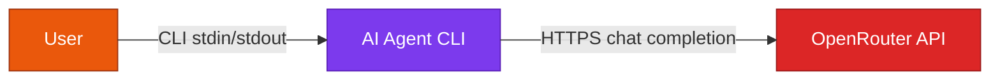
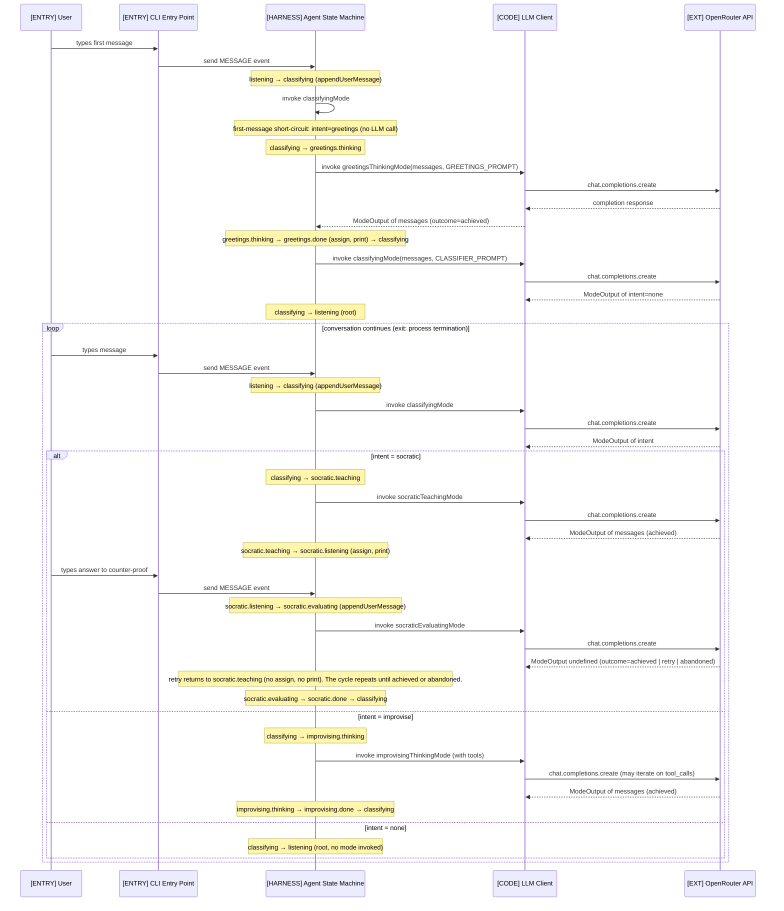

# Atlas: Mode-based Agent Orchestration

[](https://www.npmjs.com/package/@eduardorenani/atlasjs)
[](LICENSE)
[](#)

Monorepo with two packages:

- [`packages/atlas/`](packages/atlas/) — TypeScript library for mode-based agent orchestration. Published to npm as [`@eduardorenani/atlasjs`](https://www.npmjs.com/package/@eduardorenani/atlasjs).
- [`examples/zoe/`](examples/zoe/) — example agent built on Atlas (CLI in Portuguese, OpenRouter / Claude Sonnet).

## Install

```bash
npm install @eduardorenani/atlasjs@alpha xstate
```

`xstate@^5` is a peer dependency. ESM only, Node ≥ 20.

User-facing docs: [`docs/USAGE.md`](docs/USAGE.md). Spec index: [`docs/specs/README.md`](docs/specs/README.md).

## Atlas

`atlas` is a TypeScript library for mode-based agent orchestration. It enforces a specific model:

- A **mode** is a unit of agentic work with one well-defined **goal**.
- A mode terminates with one of four **outcomes**: `achieved` / `retry` / `abandoned` / `error`.
- **Exits are bound to outcomes** — routing happens over the outcome + its typed payload, not over arbitrary conditions.

Three constructors (`defineMode`, `defineCompoundMode`, `defineAgent`) are the only way to express the shape. The type system rejects anything that doesn't fit: active+passive mixing in the same leaf, modes missing outcomes, cross-compound targets, retry with arbitrary target.

State machines (XState v5) live under the hood — atlas compiles to one to get the formal carrier (transitions, hierarchy, snapshot/replay) without exposing it as the API surface.

Spec: [`docs/specs/004-xstate-agent-wrapper.md`](docs/specs/004-xstate-agent-wrapper.md).

## Zoe (example agent)

Zoe demonstrates Atlas. CLI agent that converses in Portuguese: classifies the user's intent on each turn and dispatches to a specialized mode — `greetings`, `improvising` (general Q&A with tool use), or `socratic` (multi-turn teaching with self-evaluation). Earlier observations from building Zoe on raw XState — before Atlas — are in the [Takeaways](#xstate-v5-interface--takeaways) section; they motivated the library.

## Setup

```bash
npm install
cp .env.example .env
# Fill in OPENROUTER_API_KEY in .env
npm start
```

## Architecture (zoe)

Diagrams describe Zoe — the example agent. Atlas itself is a library and has no runtime topology.

### System Context

<!-- mermaid-source: docs/architecture/c4/c1-context.mmd -->

<!-- /mermaid-source -->

### Chat Flow

<!-- mermaid-source: docs/architecture/c4/flows/user-chat.mmd -->

<!-- /mermaid-source -->

> Diagrams are synced from `docs/architecture/` source files. To update, edit the `.mmd` files and run `npm run sync:diagrams` (also runs automatically pre-commit).

## Design Decisions

These emerged while building Zoe on raw XState (M1). Atlas (M4) lifts them from convention into a type-enforced API — `ModeOutput<T>`, the four-outcome contract, and goal-bound exits are no longer authorial discipline but compile-time guarantees.

Full list in [`docs/design-decisions.md`](docs/design-decisions.md). The most important ones:

### States are agent modes (DD-002)

Each state represents a mode the agent operates in — `greetings`, `socratic`, `improvising`. Every mode has a **goal**: greetings aims to greet the user, socratic aims to teach and verify understanding, improvising aims to answer a general question. The mode's behavior is fully contained within its compound state and state file.

### Invoke is behavior, onDone is routing (DD-010, DD-011)

The invoked actor *is* the agent's behavior in that mode — it calls the LLM, performs side effects (e.g. printing the response), and returns a typed output. `onDone` does two things and nothing else: assigns the output to context (plumbing) and routes to the next state via inline guards on the output (routing).

### Three exits from a mode

When an actor completes, its output determines one of three outcomes:

1. **Goal achieved** — the mode accomplished what it set out to do. The machine exits the mode and transitions to a success state (e.g. `done` → `classifying`).
2. **Abandoned** — the goal was not achieved, but a quit criterion was met (user asked to stop, retry limit reached). The machine exits the mode without achieving the goal.
3. **Retry** — the goal was not achieved and no quit criterion was met. The machine stays in the mode and tries again.

This is formalized through `ModeOutput<T>` — every actor returns `{ outcome, payload }` where `outcome` is `"achieved" | "retry" | "abandoned"` and `payload` carries mode-specific data. Guards on `onDone` inspect `event.output.outcome`, and the first match determines the transition. The LLM's judgment becomes a typed value that the machine routes on declaratively.

Not every mode uses all three exits. One-shot modes like `greetings` and `improvising` always achieve their goal on first execution (single `onDone` → `done`). Multi-turn modes like `socratic` use the full three-exit pattern in their evaluating sub-state.

### Behavior lives in the actor, not in transitions (DD-011)

Observable side effects — printing to stdout, logging, anything the user perceives — are performed inside the actor, not in `onDone` actions. The actor has the data and the context to act; `onDone` should not carry behavior that belongs to the mode.

## XState v5 Interface — Takeaways

Observations from M1 — building Zoe directly on XState, before Atlas existed. Not a review of XState as a library; these are conclusions about its programming model as a substrate for agent orchestration. The "what doesn't" section is exactly the gap Atlas closes.

### What works

**True state machine, not a flowchart.** XState enforces finite state semantics. A state only handles the events it declares. Everything else is silently ignored. This is the single most important property for an agent: if the LLM is thinking, the machine cannot accept a new user message — not because of a flag, but because the `thinking` state simply does not list `MESSAGE` in its transitions. The constraint is structural, not conditional.

**Hierarchy.** A state can contain a full sub-machine. `improvising` is itself a state machine with `thinking` and `done` states, but from the parent's perspective it is a single state. This maps naturally to agent behavior modes: the parent machine selects the mode, the child machine runs it. Transitions between modes are parent-level; transitions within a mode are internal to the child.

**Event-driven with immutable state.** All mutations go through `assign()`, which returns a new context object. Combined with event-driven transitions, this makes every state change traceable: you can always answer "what event caused this transition and what did it change in context."

### What doesn't

**Invoke actors are separated from the states they belong to.** The only way to run async code (LLM calls, tool execution) is via `invoke`, which references an actor declared in `setup()`. The actor definition lives at the top of the file; the state that invokes it lives inside `createMachine()`. In an AI agent, a state's behavior *is* its invoked actor — `improvising` *is* `improvisingNode`. These are conceptual pairs forced apart by the API. We mitigated this with a naming convention (DD-008: actor name mirrors state path + `Node` suffix) and dedicated state files (DD-009), but the indirection remains.
