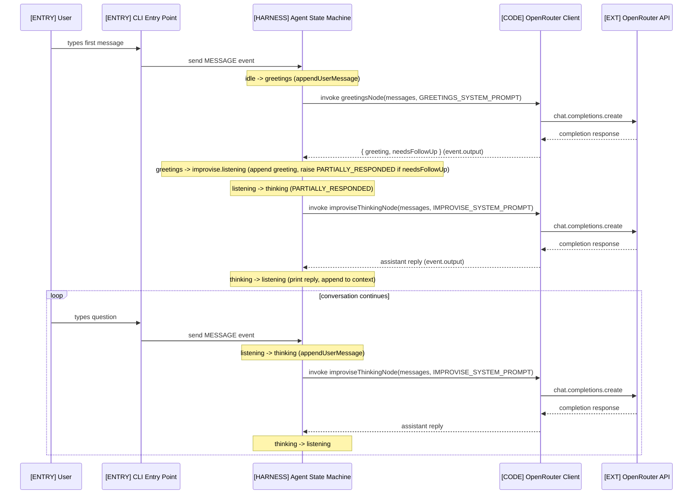

# AI Agent XState

Minimal AI agent (Atlas) built with XState v5 to evaluate the library as an orchestration layer for AI agents. CLI interface that converses in Portuguese via OpenRouter (Claude Sonnet). Each state carries its own system prompt — the agent greets, then processes the user's message. Conclusions are documented in the [Takeaways](#xstate-v5-interface--takeaways) section.

## Setup

```bash
npm install
cp .env.example .env
# Fill in OPENROUTER_API_KEY in .env
npm start
```

## Architecture

### System Context


### Chat Flow



## XState v5 Interface — Takeaways

Observations from building this agent. Not a review of XState as a library — these are conclusions about its programming model for AI agent orchestration.

### What works

**True state machine, not a flowchart.** XState enforces finite state semantics. A state only handles the events it declares. Everything else is silently ignored. This is the single most important property for an agent: if the LLM is thinking, the machine cannot accept a new user message — not because of a flag, but because the `thinking` state simply does not list `MESSAGE` in its transitions. The constraint is structural, not conditional.

**Hierarchy.** A state can contain a full sub-machine. `improvise` is itself a state machine with `listening` and `thinking` states, but from the parent's perspective it is a single state. This maps naturally to agent behavior modes: the parent machine selects the mode, the child machine runs it. Transitions between modes are parent-level; transitions within a mode are internal to the child.

**Event-driven with immutable state.** All mutations go through `assign()`, which returns a new context object. Combined with event-driven transitions, this makes every state change traceable: you can always answer "what event caused this transition and what did it change in context."

### What doesn't

**Invoke actors are separated from the states they belong to.** The only way to run async code (LLM calls, tool execution) is via `invoke`, which references an actor declared in `setup()`. The actor definition lives at the top of the file; the state that invokes it lives inside `createMachine()`. In an AI agent, a state's behavior *is* its invoked actor — `greetings` *is* `greetingsNode`, `improvise.thinking` *is* `improviseThinkingNode`. These are conceptual pairs forced apart by the API. We mitigated this with a naming convention (DD-008: actor name mirrors state path + `Node` suffix), but the indirection remains. As the number of states grows, navigating between "what this state does" and "how it does it" requires jumping across the file.

**Guards and flags erode the machine's readability.** XState supports `cond`/`guard` on transitions and boolean flags in context to alter behavior at runtime. This is the escape hatch that turns a state machine back into a flowchart — the transition graph is no longer what you see in the diagram, because any edge might be conditionally disabled. For agent orchestration, if a transition depends on a runtime condition, it is better to model that condition as a distinct state (making it visible in the diagram) rather than hiding it behind a guard. We avoided guards entirely in this project and used `raise()` with conditional logic inside `enqueueActions` instead, which keeps the state chart honest.
