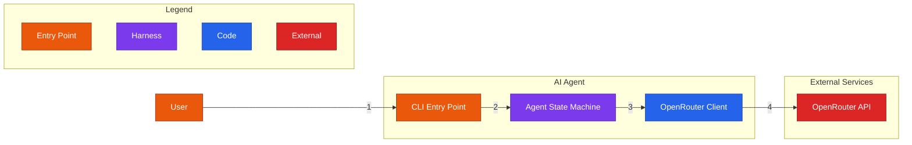
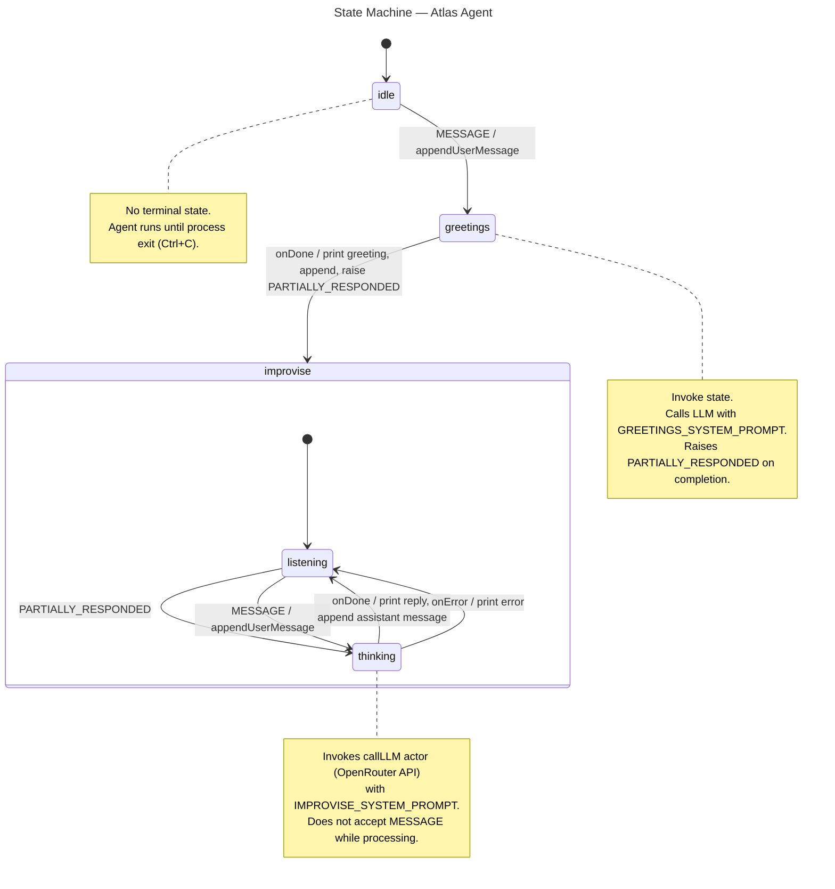

# AI Agent XState

Minimal AI agent (Atlas) built with XState v5 for learning state machine fundamentals. CLI interface that converses in Portuguese via OpenRouter (Claude Sonnet). Each state carries its own system prompt — the agent greets, then processes the user's message.

## Setup

```bash
npm install
cp .env.example .env
# Fill in OPENROUTER_API_KEY in .env
npm start
```

## Architecture

### C1 — System Context


### C2 — Containers



| # | Origin -> Destination | Protocol | Payload |
|---|---|---|---|
| 1 | User -> CLI Entry Point | CLI stdin | plain text message |
| 2 | CLI Entry Point -> Agent State Machine | in-process `actor.send()` | `{ type: "MESSAGE", text }` |
| 3 | Agent State Machine -> OpenRouter Client | in-process invoke | `{ messages: Array<{ role, content }>, systemPrompt: string }` |
| 4 | OpenRouter Client -> OpenRouter API | HTTPS POST (sync) | `chat.completions.create` |

### Chat Flow


### State Machine



## Project Structure

```
src/
  index.ts          # Entry point — readline loop + actor
  machine.ts        # XState state machine definition
  openrouter.ts     # OpenAI SDK client configured for OpenRouter
docs/
  specs/            # Behavior specifications (source of truth)
  design-decisions.md
  architecture/     # C4 + behavioral diagrams (.mmd)
```
